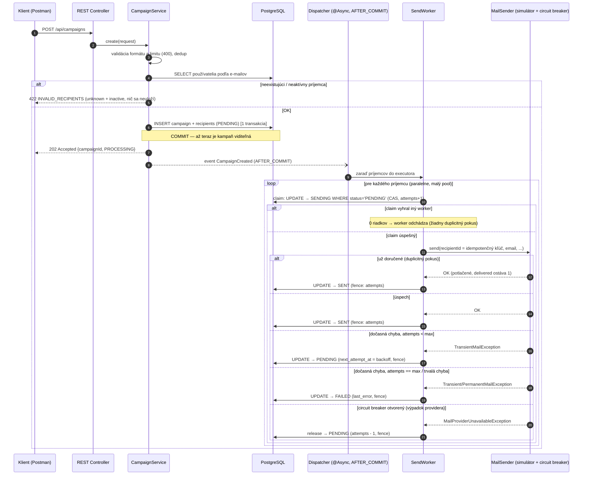
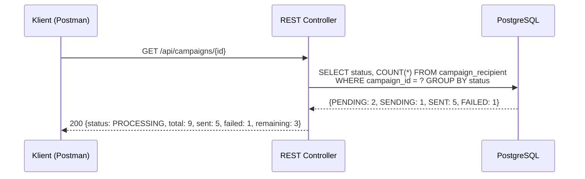
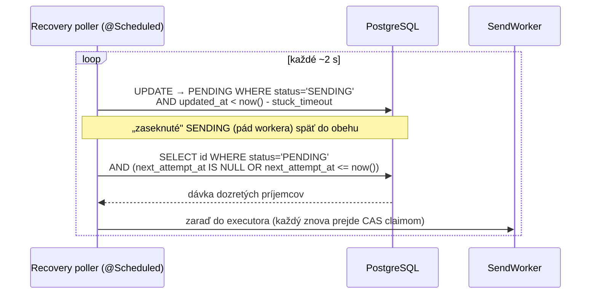
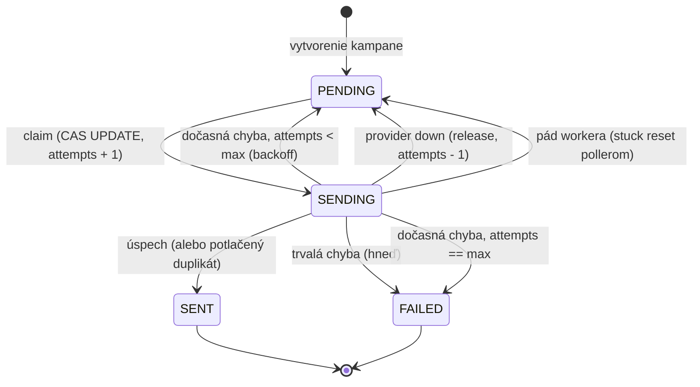

# 3 · Schéma toku spracovania

## 1. Vytvorenie kampane a asynchrónne odoslanie

Klient dostáva odpoveď v kroku 8 — **pred** akýmkoľvek pokusom o odoslanie.
Zápisy výsledku sú fencované hodnotou `attempts` z claimu: oneskorený worker
(ktorého claim medzitým prevzal iný) zapíše 0 riadkov a výsledok sa zahodí.

## 2. Zisťovanie stavu (kedykoľvek počas spracovania)

Stav sa **počíta z dát** — žiadne počítadlá v pamäti, odpoveď je správna aj po reštarte.
Rovnakým princípom funguje `GET /api/campaigns/{id}/deliveries` — pridáva pohľad
providera (`providerCalls` / `delivered` / `duplicatesSuppressed`) na overenie, že
nikto nedostal ten istý e-mail dvakrát.

## 3. Zotavenie po reštarte / dočasnej chybe (recovery poller)

Dvojité podanie (poller aj dispatcher naraz) je neškodné — CAS claim pustí len jedno
spracovanie. Poller pokrýva tri situácie jedným mechanizmom:

| Situácia | Ako ju poller rieši |
|---|---|
| reštart aplikácie po prijatí kampane | `PENDING` riadky v DB prežili → dokončia sa |
| dočasná chyba s backoffom | `next_attempt_at` dozrel → nový pokus |
| pád workera uprostred odosielania | `SENDING` starší než stuck timeout → späť do `PENDING` |

Asynchrónny dispatch po commite je len **optimalizácia latencie** — **garanciu
dokončenia dáva poller + databáza**.

## 4. Stavový automat príjemcu (súhrn)

Kampaň: `PROCESSING`, kým existuje `PENDING`/`SENDING` príjemca; potom `COMPLETED`.
